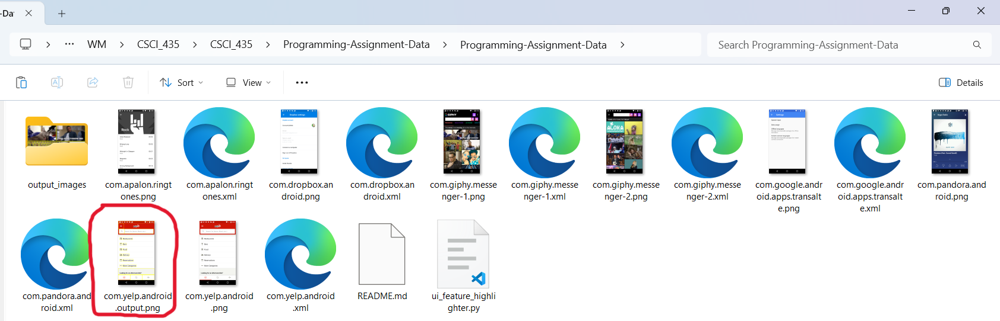
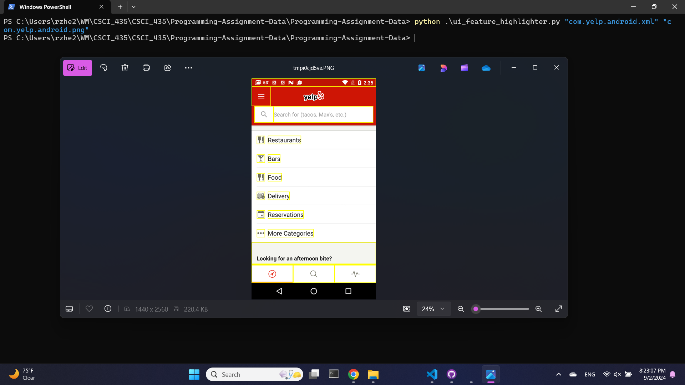

# **UI Feature Highligher**

## **Overview**
ui_feature_highlighter.py takes a screenshot/xml file pair and outputs a new annotated screenshot where leaf level components (in the xml file) are highlighted with a yellow box.

## **Usage**
The python script takes two positional command line arguments and one optional command line argument. The first and second arguments are the input xml file and png file respectively and are required for the codde to run. The user can put the path of the xml/png files or their filename if the xml/png file is in the same directory as the python script. Also, note that any filenames with spaces or special characters should be put in quotation marks. The last argument,  `--save`, gives the user the option to save the output annotated screenshot to the directory the python script is currently in. If  `--save` is not included in the command line, then the python script will simply have the output show up on the users screen.

#### **Example 1: With `--save`**

 ```
 python ui_feature_highlighter.py "com.yelp.android.xml" "com.yelp.android.png" --save
 ```


#### **Example 2: Without `--save`**
 ```
 python ui_feature_highlighter.py "com.yelp.android.xml" "com.yelp.android.png"
 ```
