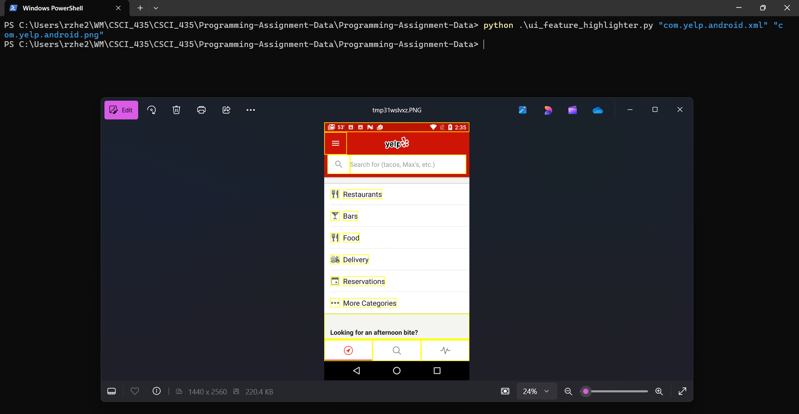

# **UI Feature Highligher**

## **Overview**
ui_feature_highlighter.py takes a screenshot/xml file pair and outputs a new annotated screenshot where leaf level components (in the xml file) are highlighted with a yellow box.

## **Usage**
The python script takes two positional command line arguments and one optional command line argument. The first and second arguments are the input xml file and png file respectively and are required for the codde to run. The user can put the path of the xml/png files or their filename if the xml/png file is in the same directory as the python script. Also, note that any filenames with spaces or special characters should be put in quotation marks. The last argument,  `--save`, gives the user the option to save the output annotated screenshot to the directory the python script is currently in. If  `--save` is not included in the command line, then the python script will simply have the output show up on the users screen.

#### **Example 1: With `--save`**

 ```
 python ui_feature_highlighter.py "com.yelp.android.xml" "com.yelp.android.png" --save
 ```


#### **Example 2: Without `--save`**
 ```
 python ui_feature_highlighter.py "com.yelp.android.xml" "com.yelp.android.png"
 ```


## **Description of Solution**
First, we find all the leaf level components in the xml file using depth first search and recursion and put them in a list. Then, we iterate through the list of leaf level components and highlight each leaf level component with the help of the "bounds" attribute of the leaf level component and the ImageDraw module that is part of the Python Imaging Library (PIL). Finally, we either save the image or show the image based on what the user has put in the command line.

## **Design Decisions Explanations**
* Using Python: I am most familiar with using libraries in Python, and Python conveniently has an imaging library I could use to draw rectangles on the screenshots.
* Error handling of bad xml files: In the case of any xml parsing issues, I chose to end the program and let the user know of the issue rather than write code to try to fix the xml file. We know that the issue in "com.apalon.ringtones.xml" is that there is a <node> tag that is not closed by a corresponding </node> tag and we can easily fix that, but it is impossible to anticipate all the problems that may arise in an xml file. Therefore, I think it should be the users responsibility to make sure the xml file they provide is parseable.
* One pair of xml/screenshot pairs at a time: I considered writing my script so that it would create all the annotated screenshots in one run of the code, but I decided otherwise. Another user might not follow the same naming conventions for the xml/png files, or they might have their files sorted in non alphabetical order. If this is the case, it would be difficult to know which xml files and png files correspond with each other.
